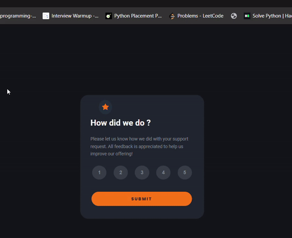

# Interactive Rating Component

This is a nice, small project to practice handling user interactions and updating the DOM. Perfect for anyone who wants to brush up the basics of JavaScript!

## Features

- **Interactive Rating:** Users can select a rating by clicking on the rating buttons.
- **Responsive Design:** The layout is designed to be responsive and works well on different screen sizes.
- **Bootstrap Icons:** Utilized Bootstrap for incorporating icons.
- **Color Picker Integration:** External libraries like color pickers are used for selecting the exact color combinations.

## Demo



## Technologies Used

- **HTML**
- **CSS**
- **JavaScript**
- **Bootstrap**
- **External Libraries** (e.g., color picker)

## Project Structure

- index.html
- styles.css
- script.js
- README.md
- assets/
  - icons/


### Prerequisites

- A modern web browser
- Code editor (optional but recommended)

### Installation

1. Clone the repository:
    ```sh
    git clone https://github.com/your-username/interactive-rating-component.git
    ```
2. Navigate to the project directory:
    ```sh
    cd interactive-rating-component
    ```


